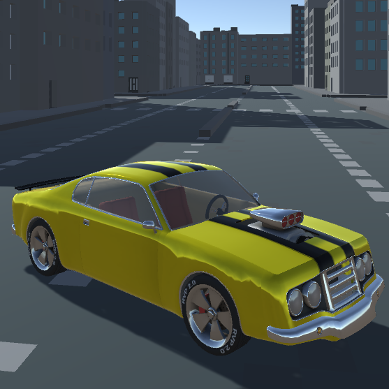
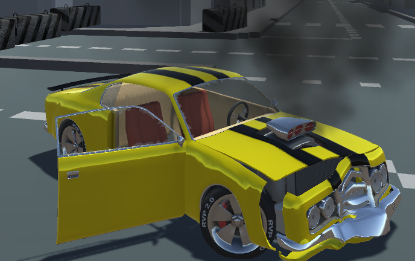
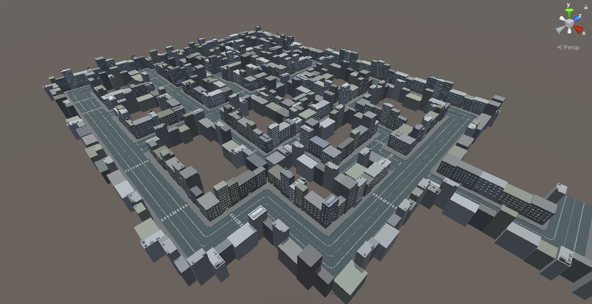
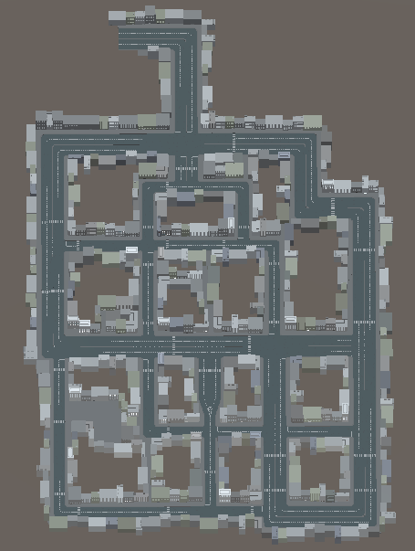
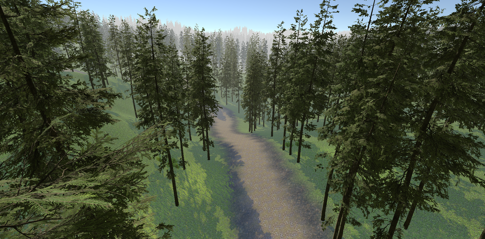
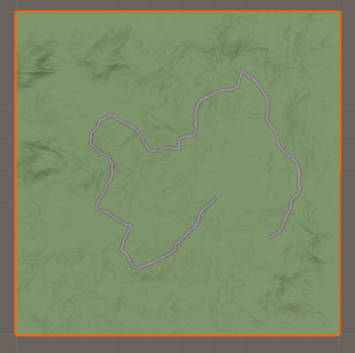

# Vehicle simulator

This is bachelor's thesis - vehicle simulator (i.e. race game) made with Unity

## Project description

- Responsive controls for vehicle
- Car model respond to physical conditions: damage and various types of surfaces
- Corresponding sounds for events
- Main menu, end game menu, pause menu
- Two maps to drive on:
  - City made with CityVoxelPack
  - Forest made with based Terrain Tools Sample Asset Pack and other assets for greenery
- Two modes: freeride (only city map) and time race

The most important asset in this project is Randomation Vehicle Physics from which car model was taken. It has good damage model and was configured to act differently on each surface, especially on forest map. In addition this car has modeled engine with gears.

Unity version used is 2020.3.0

## Used assets

- [Randomation Vehicle Physics](https://github.com/JustInvoke/Randomation-Vehicle-Physics)
- [CityVoxelPack](https://assetstore.unity.com/packages/3d/environments/urban/city-voxel-pack-136141)
- [Road Blocker](https://assetstore.unity.com/packages/3d/props/exterior/road-blocker-663)
- [Grass Flowers Pack Free](https://assetstore.unity.com/packages/2d/textures-materials/nature/grass-flowers-pack-free-138810)
- [Grass And Flowers Pack 1](https://assetstore.unity.com/packages/2d/textures-materials/nature/grass-and-flowers-pack-1-17100)
- [Conifers [BOTD]](https://assetstore.unity.com/packages/3d/vegetation/trees/conifers-botd-142076)
- [Outdoor Ground Textures](https://assetstore.unity.com/packages/2d/textures-materials/floors/outdoor-ground-textures-12555)
- [Terrain Tools Sample Asset Pack](https://assetstore.unity.com/packages/3d/environments/landscapes/terrain-sample-asset-pack-145808)

## Results

:link:[Link to youtube for demonstration](https://youtu.be/lilHbgEHiik?)

|  |
| :----------------------: |
|     _Used car model_     |

|  |
| :----------------------------------: |
|            _Damaged car_             |

|  |
| :------------------------: |
|      _City birdview_       |

|  |
| :--------------------------------: |
|             _City map_             |

|  |
| :----------------------------: |
|         _Forest level_         |

|  |
| :--------------------------------: |
|            _Forest map_            |
